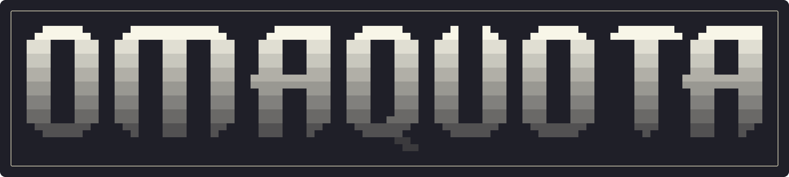
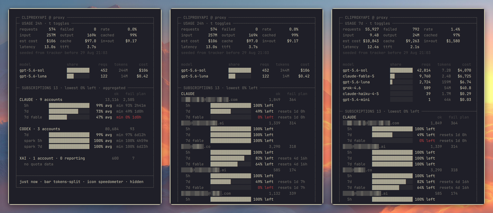

<!--
 ▄█████▄    ▄███████████▄     ▄███████   ▄█████▄    ▄█   █▄    ▄█████▄   ▄███████▄  ▄███████
███   ███  ███   ███   ███   ███   ███  ███   ███  ███   ███  ███   ███     ███    ███   ███
███   ███  ███   ███   ███   ███   ███  ███   ███  ███   ███  ███   ███     ███    ███   ███
███   ███  ███   ███   ███  ▄███▄▄▄███  ███   ███  ███   ███  ███   ███     ███   ▄███▄▄▄███
███   ███  ███   ███   ███  ▀███▀▀▀███  ███   ███  ███   ███  ███   ███     ███   ▀███▀▀▀███
███   ███  ███   ███   ███   ███   ███  ███   ███  ███   ███  ███   ███     ███    ███   ███
███   ███  ███   ███   ███   ███   ███  ███  ▄███  ███   ███  ███   ███     ███    ███   ███
 ▀█████▀    ▀█   ███   █▀    ███   █▀    ▀█████▀    ▀█████▀    ▀█████▀      ▀█▀    ███   █▀
                                              ▀█▄
-->

[CLIProxyAPI](https://github.com/router-for-me/CLIProxyAPI) usage and per-subscription quota in the [Omarchy](https://omarchy.org) bar.



## Install

```sh
omarchy plugin add https://github.com/njpatel/omaquota.git --enable
~/.config/omarchy/plugins/njpatel.omaquota/bin/omaquota-setup
omarchy restart shell
```

Setup asks for the proxy URL and its management key (the plaintext one, not the hash in `config.yaml`). Usage starts counting from then: the 24h and 7d views are rolling windows that fill in as data arrives (the panel says so until they are full). The proxy needs `remote-management.allow-remote` if it is not on localhost and `usage-statistics-enabled` for the stats block. Omaquota consumes the proxy's usage queue, so run only one consumer. The proxy drops queued records older than `redis-usage-queue-retention-seconds` (default **60**, max 3600) - set it to 3600 in the proxy's config.yaml, otherwise anything between two refreshes is lost and every number is an undercount; the cost line is an estimate at [models.dev](https://models.dev) list prices. If the `cap-token-usage-tracker` plugin is installed, history from before Omaquota is seeded from it once.

## Use

Click the icon.

| key | |
|---|---|
| `e` | aggregate per provider / every account |
| `t` | 24h / 7d |
| `h` | redact account names |
| `r` | cycle what the bar shows |
| `i` | cycle the bar icon |
| `Enter` | refresh |
| `j` `k` | scroll |

The icon turns urgent when a 5h or 7d window drops to 10%. The number beside it always covers the **last 24 hours**; choose what it shows with `r` in the panel or `barMetric`: `tokens` (new input + output, default), `tokens-split` (`↑new input ↓output`), `requests`, `cost`, or `none` - e.g. `omarchy bar set njpatel.omaquota barMetric cost`. The icon is `barIcon`: a name such as `gauge`, `speedometer`, `pulse`, `waveform`, `coins`, `usd`, `counter`, `chart`, `brain`, `robot`, `server` (full list in `manifest.json`), or any Nerd Font glyph.

> **Status:** the token and cost accounting is still being verified against real traffic (a queue-retention bug that undercounted everything was only found on 30 Aug). Treat the usage figures as indicative until this note goes away; the quota panel is unaffected.

## Where the numbers come from

- **Usage** is built from the proxy's own per-request records (`GET /v0/management/usage-queue`), folded into hourly buckets and kept for 7 days. Per request: uncached input, cache reads, cache writes and output (output includes reasoning tokens). The panel follows the `ccusage` / `claude /cost` convention: `input` is the uncached tokens, `cache rd` and `cache wr` are cache reads and writes, `total` is all four parts, and `hit rate` is reads ÷ (uncached + reads). The bar counts only uncached input (cache reads re-send the whole conversation every turn and would swamp it); hover the number for the cache figures.
- **Cost** prices those four parts separately at [models.dev](https://models.dev) list rates for the model, refreshed daily. It is an estimate: context-tier and service-tier surcharges are ignored.
- **Quota** is what each provider reports for the account (Anthropic `oauth/usage`, ChatGPT `wham/usage`, grok billing), fetched through the proxy's `api-call` passthrough, no more often than `quotaIntervalSec`.

## License

Apache-2.0
